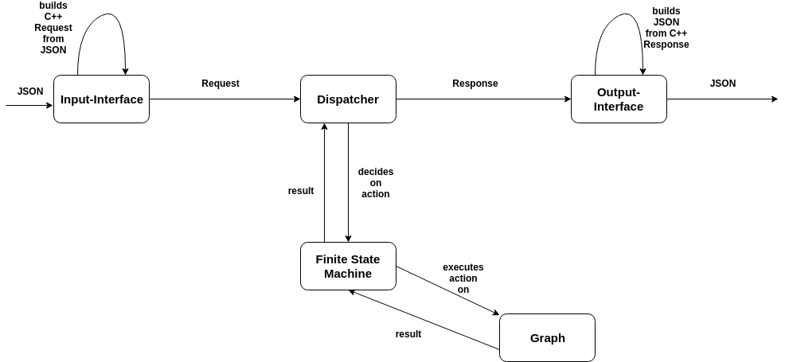

# CFLOP

[](https://travis-ci.com/fh-tech/CFLOP)

##Finite State Machine Simulation

### Communication between back- and frontend via JSON (HTTP-Style)

####1. General
CFLOP is a Backend written in C++ which provides all functionality needed for a Finite State Machine.
Communication takes place via JSON. The backend takes a Request in JSON and converts it to a C++ request representation. 
After that the dispatcher takes the request looks at its type and decides which action to execute. Then the finite state 
machine executes the action on the graph. The generated result of this action is then converted to a C++ response representation,
which is then further converted back into JSON.

We built the classes and logic with extensibility in mind. So one could exchange input/output format and also 
which kind of graph is used easily in the future.
It would also be possible to build a webserver around this backend.

So pretty much any front end can be built using this backend. Feel free to use it!



#### 2. Endpoints 
A short list of endpoints which can be used and how to communicate with them. 
##### 2.1 NODES
* POST  
    * adds a new node to the graph
    * request
    ```json
      {
        "nodes": {
          "post": {}
        }
      }
    ```
    * response
    ```json
    {
      "success": {
        "node": { "id": 0 }
      }
    }
    ```
* DELETE  
    * deletes node with given ID from the graph
    * request
    ```json
    {
      "nodes": {
        "delete": {
          "id": 0
        }
      }
    }
    ```
    * response 
    ```json
    {
      "success": {}
    }
    ```
    
* GET  
    * gets the node object with the given ID  
    * request  
    ```json
      {
        "nodes": {
          "get": {
            "id": 0
          }
        }
      }
    ```  
    * response (success)
      
    ```json
    {
      "success": {
        "node":{
          "id": 0,
          "edges": [1,2,3]
        }
      }
    }
    ``` 
* PUT/START  
    * sets the node with the given ID as starting point
    * request
    ```json
    {
      "nodes":{
        "put":{
          "start":{
            "id": 0
          }
        }
      }
    }
    ```
    * response
    ```json
    {
      "success": {}
    }
    ```
* PUT/END
    * sets the node with the given ID as end point
    * request
    ```json
    {
      "nodes":{
        "put":{
          "end":{
            "id": 0
          }
        }
      }
    }
    ```
    * response
    ```json
    {
      "success": {}
    }
    ```
    
    
#### 2.2 EDGES  
* GET
    * gets the edge object with the given ID  
    * request
    ```json
    {
      "edges": {
        "get": {
          "id": 0
        }
      }
    }
    ```
    * response
    ```json
    {
      "success": {
        "edge": {
          "id": 0,
          "from": 1,
          "to": 2,
          "transition": "a"
        }
      }
    }
* POST  
    * adds an edge between the two given nodes (IDs)
    * request
    ```json
    {
      "edges":{
        "post":{
          "to": 1,
          "from": 2,
          "transition": "a"
        }
      }
    }
    ```
    * response
     ```json
        {
          "success": {
            "node": { "id": 0 }
          }
        }
     ```
* DELETE  
    * deletes node with the given ID
    * request
    ```json
    {
      "edges": {
        "delete": {
          "id": 0
        }
      }
    }
    ```
    * response
    ```json
    {
      "success":{}
    }
    ```

####2.3 STATE
* GET
    * gets the current state of the graph (all nodes, all edges, start, end, active) (save)
    * request
    ```json
    {
      "state":{
        "get":{}
      }
    }
    ```
    * response
    ```json
    {
      "success":{
        "state":{
          "nodes": [
            {
              "id": 0,
              "edges": [1,2,3]
            }, {
              "id": 1,
              "edges": [1,3]
            }
          ],
          "edges":[
            {
              "id": 1,
              "from": 0,
              "to": 1,
              "transition": "a"
            }
          ],
          "active": 1,
          "start": 1,
          "end": 0
        }
      }
    }
    ```
* POST
    * sets the state of the graph (load) 
    * request
    ```json
    {
      "state":{
        "post":{
          "state": {
            "nodes": [
              {
                "id": 0,
                "edges": [1,2,3]
              }, {
                "id": 1,
                "edges": [1,3]
              }
            ],
            "edges":[
              {
                "id": 1,
                "from": 0,
                "to": 1,
                "transition": "a"
              }
            ],
            "active": 1,
            "start": 1,
            "end": 0
          }
        }
      }
    }
    ```
    * response
    ```json
    {
      "success": {}
    }
    ```
     
* PUT  
    * takes a given transition and executes a step in the graph with it
    * request  
    ```json
    {
      "state": {
        "put": {
          "input": "a"
        }
      }
    }
    ```
    * response  
    ```json
    {
      "success": {
        "node": {"id": 0}
      } 
    }
  
    ```
    
    
#### 2.4 failed request
for every call that fails you get following response with a message  
```json
    {
      "error": {
        "message": "some fail message"
      }
    }
```
